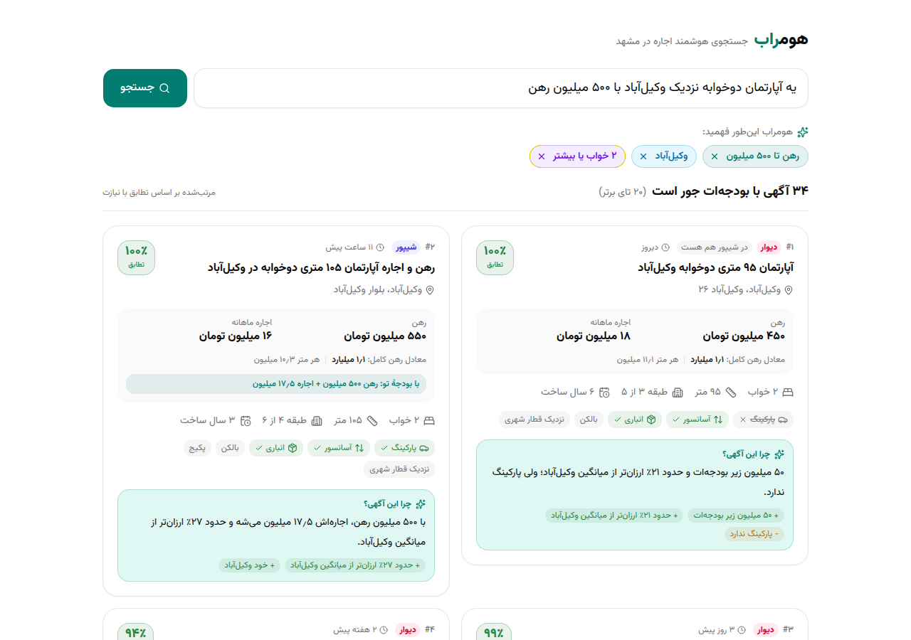
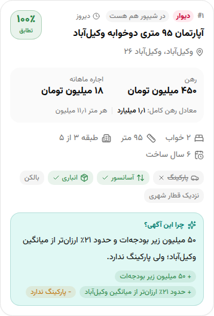
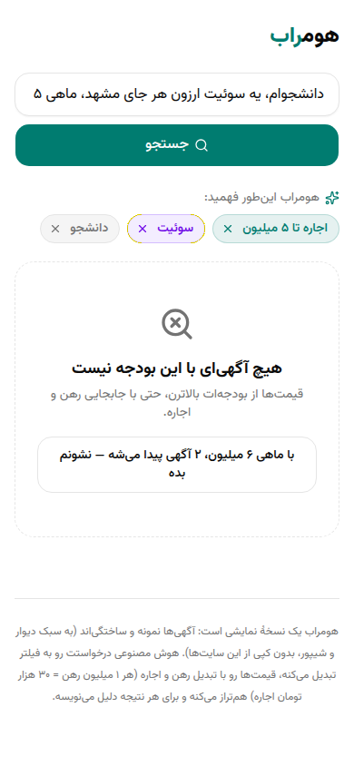

# Homerob 🏠

**AI-powered rental search & comparison for Mashhad — "Torob for home".**

🔗 **Live demo: https://homerob.vercel.app**

Built for [Torob](https://torob.com)'s **AI Product Engineer** hiring challenge — an exploration of what "Torob for real estate" could look like.

> ترب برای پیدا کردن بهترین قیمت کالا رو ساده کرده؛ Homerob همون کارو برای پیدا کردن خونه انجام می‌ده.



---

## The Problem

Searching for a rental home in Iran today (via Divar, Sheypoor, etc.) means:

- **Messy, unstructured listings** — free-text descriptions, inconsistent formatting, no standard schema
- **Rahn/Ejare confusion** — deposit (رهن) and rent (اجاره) are quoted in dozens of different combinations, making true cost comparison nearly impossible
- **No price transparency** — no way to tell if a listing is fairly priced for its neighborhood
- **Manual, exhausting comparison** — users scroll through hundreds of ads to find what actually fits their budget and needs

## The Idea

Homerob is a **meta-search / AI-normalization layer** on top of existing listings — not a new classifieds site. You type what you need in everyday Persian, and it:

1. **Understands** the request — budget, neighborhood, rooms, must-haves vs. nice-to-haves — and shows it back as editable chips
2. **Normalizes** every listing's rahn/ejare split to comparable numbers (full-deposit equivalent, price per m², and *your* split if the landlord allows conversion)
3. **Ranks** listings by fit (hard budget filter + soft, weighted scoring)
4. **Explains** each top result in plain Persian — including the trade-off (e.g. «۵۰ میلیون زیر بودجه‌ته و خود وکیل‌آباده، ولی پارکینگ نداره.»)

## How it works

```
«یه دوخوابه نزدیک وکیل‌آباد با ۵۰۰ میلیون رهن»
        │
        ▼
 POST /api/search
   1. Intent  — Gemini (strict JSON, zod-validated) → { maxDeposit: 500M, neighborhoods: [وکیل‌آباد], minRooms: 2, … }
                fallback: deterministic Persian rule parser (digits, «پونصد», «۸ تومن», «مهم نیست», …)
   2. Budget  — hard filter; rahn ↔ ejare conversion at 3%/month when user + landlord allow it
   3. Score   — 0–100 from one weights config: neighborhood (adjacent = partial), must-haves, rooms,
                area, value vs. neighborhood median per m², nice-to-haves, recency
   4. Dedup   — same apartment on Divar and Sheypoor → one card («در شیپور هم هست»)
        │
        ▼
 POST /api/explain   (async — cards render first, AI text swaps in)
   one batched Gemini call for the top 10, grounded in computed pros/cons;
   any sentence with a number not in the facts is rejected → rule-based explanation
```

Resilience: the Gemini free tier is flaky, so models are **raced** (next model after 1.5 s, 5 s deadline) and every AI step has a deterministic fallback — search never breaks. Empty results come with a one-click suggestion («با ماهی ۶ میلیون، ۲ آگهی پیدا می‌شه — نشونم بده»).

## Core Features

- 🔎 **Natural-language Persian search** — e.g. *«سوئیت یا یک‌خوابه تو سجاد، ماهی حداکثر ۸ تومن»*
- 🏷️ **"What the AI understood" chips** — remove any chip to refine instantly (no re-typing, no extra AI call)
- 💰 **Rahn ↔ Ejare normalization** — full-deposit equivalent, price per m², and the split *you* would pay
- 📊 **Fair-price signal** — cheaper/pricier than the neighborhood median per m²
- 🤖 **AI explanations with honest trade-offs** — grounded in the listing's real facts
- 🔁 **Cross-source dedup** — one card per apartment, even if it's on both Divar and Sheypoor
- 📱 **RTL, mobile-first UI** — Vazirmatn, shareable `?q=` links

| Mobile card | Empty state with suggestion |
|---|---|
|  |  |

## Tech Stack

- **Next.js 16** (App Router, route handlers) + **TypeScript**, deployed on **Vercel**
- **Tailwind CSS v4** + **shadcn/ui** (base-ui), full RTL
- **Google Gemini** (free tier) via an OpenAI-compatible client — `AI_PROVIDER` switches to DeepSeek / OpenAI / a no-key `mock` (rule-based) mode
- **zod** for intent validation, **vitest** for unit tests
- **Sample dataset** — 96 generated Divar/Sheypoor-style listings across 6 Mashhad neighborhoods (الهیه، سجاد، وکیل‌آباد، احمدآباد، هاشمیه، قاسم‌آباد). No scraping; no database.

## Run locally

```bash
npm install
cp .env.example .env.local   # optional: AI_PROVIDER=gemini + GEMINI_API_KEY=...
npm run dev                  # http://localhost:3000  (works without a key in mock mode)
npm test                     # unit tests (pricing, parser, budget, ranking, grounding)
npm run generate:listings    # regenerate src/data/listings.json (deterministic)
```

Key files: `src/lib/intent/` (schema, rule parser, LLM parser) · `src/lib/pricing.ts` · `src/lib/search/` (budget, score, dedup, suggest) · `src/lib/explain/` · `src/lib/ai/client.ts` · `src/components/`.

## Status

✅ Working demo, deployed. Built in a 2-day sprint for a hiring challenge — a demo, not production software. Sprint plan and decisions: [`docs/PLAN.md`](docs/PLAN.md), [`docs/DECISIONS.md`](docs/DECISIONS.md). Demo script: [`docs/DEMO_SCRIPT.md`](docs/DEMO_SCRIPT.md).

## Future Work

Not built for this MVP — kept here as stated direction, not a claim:

- **Live aggregation** over Divar / Sheypoor (or ingestion via Divar's public dataset / Kenar platform), replacing the sample dataset
- Smarter cross-source duplicate detection (fuzzy matching on text, photos, location) — today's is exact-match
- Real transaction-price data to improve the fair-price signal beyond a neighborhood median
- More cities, map view, saved searches / alerts

## Why This Approach

This mirrors Torob's own DNA: **aggregate → structure → compare**, applied to a market (housing) that is far messier and higher-stakes than e-commerce. The goal isn't to compete with Divar on listing volume — it's to be the smart layer on top that makes sense of what's already there.

## Author

**Mohammad Javad Heidari**
Built as part of Torob's AI Product Engineer challenge.

## License

[MIT](LICENSE)
